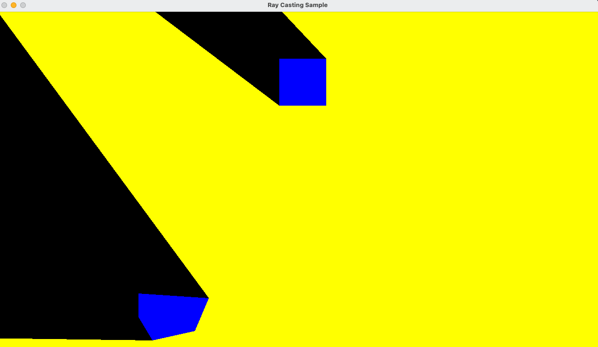

# RayCastingSample
SFMLを使ってレイキャスティングするサンプルです

## 参考にしたURL
[SIGHT & LIGHT
how to create 2D visibility/shadow effects for your game](https://ncase.me/sight-and-light/) 
[YouTube - Game Programming - Lecture 12 - Ray Casting + Line Segment Intersection](https://www.youtube.com/watch?v=wLlfmQUO88I&list=PL_xRyXins848nDj2v-TJYahzvs-XW9sVV&index=12) 
[YouTube - How to rotate a vector](https://www.youtube.com/watch?v=7j5yW5QDC2U) 
[Formula for rotating a vector in 2D](https://matthew-brett.github.io/teaching/rotation_2d.html)
